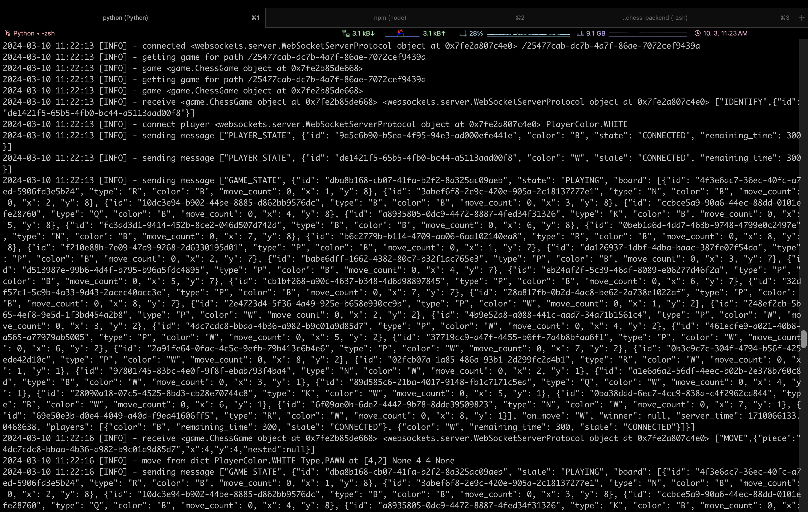

# Online-chess backend

For the frontend, visit: https://github.com/Krystofee/online-chess



# How to run?

## Dependencies

- python 3.6 (maybe 3.7, but not newer)

```
python3.6 -m venv .venv
source .venv/bin/activate
pip install -r requirements.txt
python server.py
```
